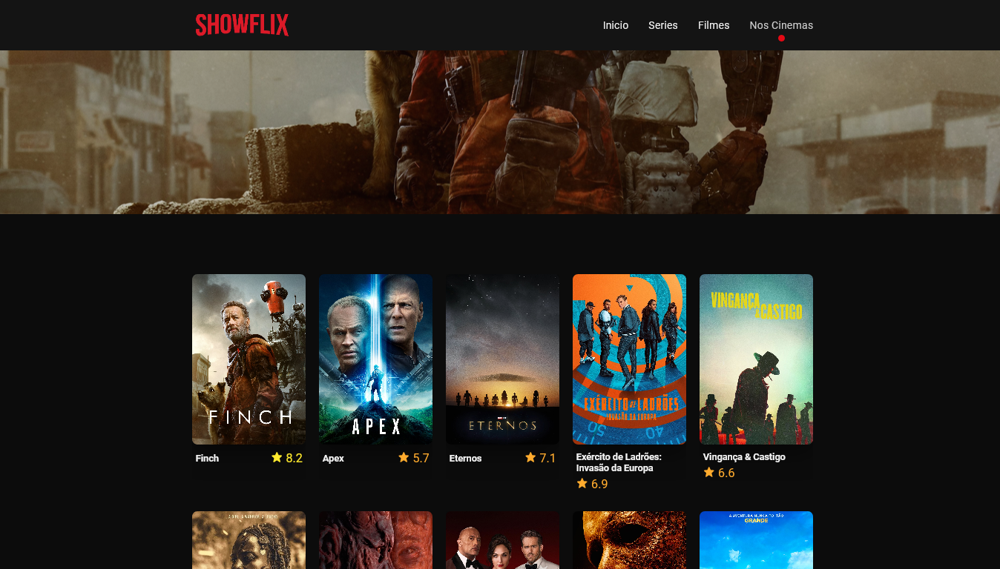

<h1 align=" center"> 
    ShowFlix 🍿
</h1>

<h1>
    
</h1>

<h2 align="center">
    <a href="https://matheusnlourenco.github.io/project-showflix/">Ver projeto</a>
</h2>
<h2>🚨 Soobre </h2>

Projeto Show Flix. Feito com js vanilla consumindo API TMDB para pegar filmes e series e mostrar nno front-end.

<h2>🔨 Ferramentas </h2>

- HTML
- CSS
- JAVASCRIPT
